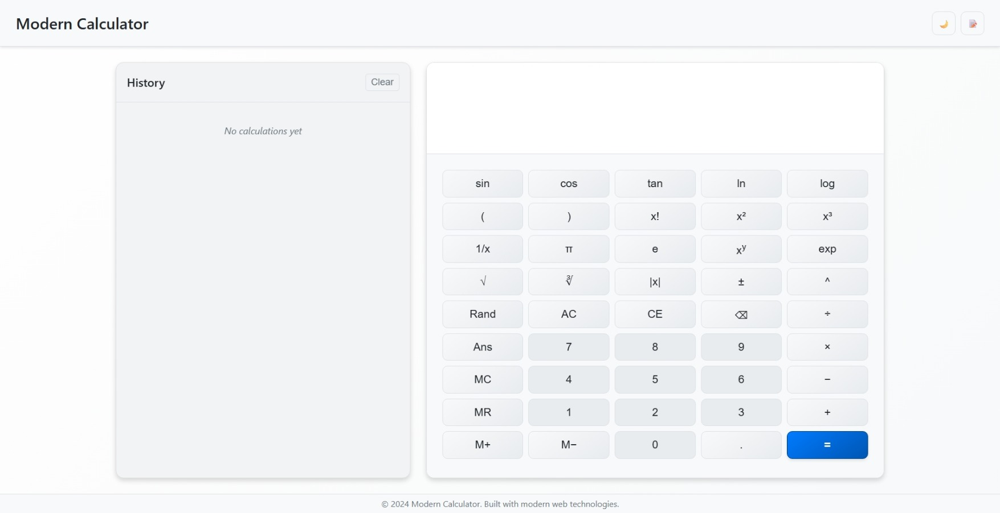
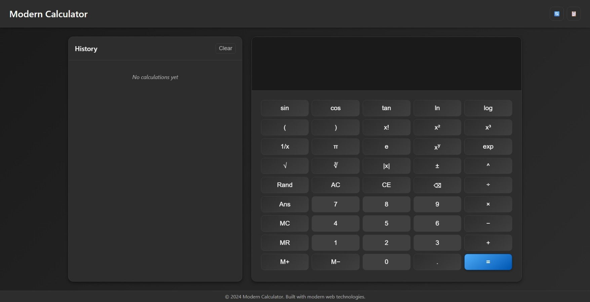

# Modern Calculator

A scientific calculator application built with vanilla JavaScript. The application implements a modular architecture with ES6 modules, supports mathematical operations including trigonometric and logarithmic functions, and provides keyboard navigation and accessibility features.

## Screenshots

### Light Theme


### Dark Theme  


## Features

### Mathematical Operations
- **Basic Operations**: Addition, subtraction, multiplication, division
- **Advanced Functions**: Trigonometric functions (sin, cos, tan), logarithmic functions, exponential operations
- **Special Functions**: Square root, power operations, factorial, reciprocal, percentage calculations
- **Mathematical Constants**: Pi (π), Euler's number (e), Golden ratio (φ)
- **Memory Functions**: Memory store, recall, add, and subtract operations
- **Angle Modes**: Calculation support for both radians and degrees

### User Interface
- **Responsive Design**: Adaptive layout with breakpoints for different screen sizes (XS, SM, MD, LG, XL, XXL)
- **Theme Support**: Light and dark theme options with CSS transitions
- **Accessibility**: Keyboard navigation support and screen reader compatibility
- **Layout**: CSS Grid-based responsive design implementation

### Input Methods
- **Keyboard Shortcuts**: Direct number and operator input (0-9, +, -, *, /, etc.)
- **Function Keys**: Quick access keys for mathematical functions (s=sin, c=cos, t=tan, l=log, q=sqrt)
- **Control Shortcuts**: System shortcuts (Ctrl+C for clear, Ctrl+H for history, Ctrl+T for theme toggle)
- **Navigation Keys**: Enter for calculation, Escape for clear, Backspace for deletion

### History Management
- **Calculation History**: Storage and display of previous calculations
- **Persistent Storage**: History data maintained using localStorage
- **Search Functionality**: Ability to search through calculation history
- **Data Management**: Export and import capabilities for history data

### Technical Implementation
- **Modular Architecture**: Component-based code organization with separation of concerns
- **ES6+ Modules**: Modern JavaScript module system with import/export statements
- **Error Handling**: Input validation and error management system
- **Security**: Expression evaluation without use of eval() function
- **Testing**: Unit test coverage using Jest framework

## Installation

### Prerequisites
- Node.js (version 14 or higher)
- npm (Node Package Manager)

### Setup Instructions

#### Option 1: Direct File Access
1. Clone the repository:
   ```bash
   git clone https://github.com/HRG-OFFICIAL/Calculator.git
   cd Calculator
   ```

2. Open `index.html` directly in a web browser

#### Option 2: Development Server
1. Clone the repository and navigate to the project directory:
   ```bash
   git clone https://github.com/HRG-OFFICIAL/Calculator.git
   cd Calculator
   ```

2. Install project dependencies:
   ```bash
   npm install
   ```

3. Start the development server:
   ```bash
   npm run dev
   ```

4. Access the application at http://localhost:3000

#### Option 3: Production Build
1. Complete steps 1-2 from Option 2

2. Generate production build:
   ```bash
   npm run build
   ```

3. Serve the production files:
   ```bash
   npm run serve
   ```

4. Access the application at http://localhost:8080

## Project Structure

```
Calculator/
├── index.html                    # Main HTML document and application entry point
├── styles/
│   └── main.css                 # CSS stylesheet containing theme definitions and responsive design rules
├── js/
│   ├── main.js                  # Application initialization and module coordination
│   └── modules/
│       ├── Calculator.js        # Core mathematical operations and calculation logic
│       ├── HistoryManager.js    # Calculation history storage and retrieval functionality
│       ├── KeyboardHandler.js   # Keyboard event processing and shortcut management
│       ├── ResponsiveManager.js # Screen size detection and responsive layout management
│       ├── ThemeManager.js      # Theme switching and preference storage
│       └── UIManager.js         # DOM manipulation and user interface updates
├── tests/
│   └── Calculator.test.js       # Unit tests for calculator functionality using Jest
├── screenshots/
│   ├── calculator-light-theme.png # Visual documentation of light theme interface
│   └── calculator-dark-theme.png  # Visual documentation of dark theme interface
├── package.json                 # Node.js project configuration, dependencies, and npm scripts
├── rollup.config.js            # Rollup bundler configuration for production builds
├── .eslintrc.js               # ESLint configuration for code quality and style enforcement
├── .gitignore                 # Git version control exclusion rules
├── LICENSE                    # MIT license terms and conditions
└── README.md                  # Project documentation and usage instructions
```

### Directory Descriptions

- **`styles/`**: Contains CSS files for visual styling, theme definitions, and responsive design rules
- **`js/`**: JavaScript source code directory containing the main application file and modular components
- **`js/modules/`**: Modular JavaScript components implementing specific functionality areas
- **`tests/`**: Unit test files for validating application functionality and ensuring code quality
- **`screenshots/`**: Visual documentation showing the application interface in different themes

## Usage

### Basic Operations
- Input numbers and operators using mouse clicks or keyboard
- Press `Enter` or `=` to execute calculations
- Use `Escape` or `AC` button to clear the display

### Mathematical Functions
- **Trigonometric Functions**: `sin`, `cos`, `tan` with support for both radian and degree angle modes
- **Logarithmic Functions**: `log` (natural logarithm), `log10` (base 10 logarithm)
- **Power Operations**: `x^y` or `^` key for exponentiation calculations
- **Root Functions**: `sqrt` for square root calculations
- **Factorial Operations**: `x!` for factorial calculations

### Memory Operations
- `MC`: Clear stored memory value
- `MR`: Recall value from memory
- `M+`: Add current display value to memory
- `M-`: Subtract current display value from memory

### Keyboard Shortcuts
| Key | Function | Key | Function |
|-----|----------|-----|----------|
| `0-9` | Number input | `+`, `-`, `*`, `/` | Basic operators |
| `Enter` | Execute calculation | `Escape` | Clear display |
| `Backspace` | Delete last character | `s` | Sine function |
| `c` | Cosine function | `t` | Tangent function |
| `l` | Natural logarithm | `q` | Square root |
| `p` | Pi constant | `e` | Euler's number |
| `b` | Absolute value | `w` | Random number |
| `a` | Previous answer | `r` | Square root |
| `Ctrl+C` | Clear all | `Ctrl+H` | Toggle history |
| `Ctrl+T` | Toggle theme | `F1` | Help display |

## Testing

Execute the complete test suite:
```bash
npm test
```

Run tests with file watching for continuous development:
```bash
npm run test:watch
```

**Note**: The test configuration currently requires ES module support setup for Jest. Tests are implemented using Jest framework with jsdom environment for DOM testing.

## Development

### Code Quality Validation
Run ESLint code analysis:
```bash
npm run lint
```

Automatically fix ESLint issues:
```bash
npm run lint:fix
```

### Build Process
Generate optimized production build:
```bash
npm run build
```

The build process uses Rollup to bundle and optimize JavaScript modules for production deployment.

## Customization

### Theme Configuration
The application implements two theme options:
- **Light Theme**: High contrast interface with blue accent colors
- **Dark Theme**: Low-light interface with purple accent colors

Theme selection is managed through CSS custom properties and data attributes.

### Adding Mathematical Functions
1. Define the new function in the `functions` object within `Calculator.js`
2. Add corresponding button element to `index.html` with appropriate `data-action` attribute
3. Update keyboard mapping in `KeyboardHandler.js` if keyboard shortcut is required

### Responsive Design Implementation
The responsive system includes:
- **Breakpoint Definitions**: XS (0-575px), SM (576-767px), MD (768-991px), LG (992-1199px), XL (1200-1399px), XXL (1400px+)
- **Device Detection**: Programmatic identification of mobile, tablet, and desktop devices
- **Orientation Handling**: Layout adaptation for landscape and portrait orientations
- **Adaptive Components**: Dynamic visibility and sizing of interface elements based on screen dimensions

### Style Modification
Theme customization is achieved through CSS custom properties. Color schemes can be modified by updating the `:root` and `[data-theme]` selectors in `styles/main.css`.

## Browser Compatibility

### Desktop Browsers
- Chrome 60 and later versions
- Firefox 55 and later versions
- Safari 12 and later versions
- Microsoft Edge 79 and later versions

### Mobile Browsers
- iOS Safari 12 and later versions
- Chrome Mobile 60 and later versions
- Samsung Internet 8 and later versions

## Contributing

### Development Process
1. Fork the repository to your GitHub account
2. Create a feature branch: `git checkout -b feature-name`
3. Implement changes with appropriate code documentation
4. Add unit tests for new functionality
5. Execute the test suite: `npm test`
6. Commit changes with descriptive messages: `git commit -m 'Add feature'`
7. Push branch to your fork: `git push origin feature-name`
8. Submit a pull request with detailed description of changes

## License

This project is distributed under the MIT License. See the [LICENSE](LICENSE) file for complete license terms and conditions.

## Dependencies

### Runtime Dependencies
- [Math.js](https://mathjs.org/) - Mathematical expression parsing and evaluation library

### Development Dependencies
- Jest - JavaScript testing framework
- ESLint - Code quality and style analysis
- Rollup - Module bundler for production builds
- Babel - JavaScript transpilation for browser compatibility

## Support

### Issue Reporting
1. Review existing issues at the [Issues](https://github.com/HRG-OFFICIAL/Calculator/issues) page
2. Create a new issue with detailed problem description
3. Include browser version, operating system, and reproduction steps
4. Provide relevant error messages or console output